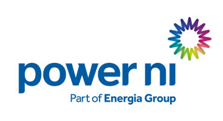

# Home Assistant Power NI

[![GitHub Activity][commits-shield]][commits]
[![License][license-shield]](LICENSE)
[![BuyMeCoffee][buymecoffeebadge]][buymecoffee]

A HACS custom integration that scrapes live electricity tariff prices from [powerni.co.uk](https://powerni.co.uk/compare-electricity-ni/unit-rates/) and exposes them as Home Assistant sensor entities.

All prices are the **Best Deal incl. VAT** for each tariff section and refresh every hour.

## Sensors created

| Entity | Description | Unit |
|--------|-------------|------|
| `sensor.power_ni_eco_energy_unit_rate` | Eco Energy best deal unit rate | p/kWh |
| `sensor.power_ni_bill_pay_unit_rate` | Bill Pay best deal unit rate | p/kWh |
| `sensor.power_ni_keypad_unit_rate` | Keypad best deal unit rate | p/kWh |
| `sensor.power_ni_electric_vehicle_anytime_day_rate` | EV Anytime day rate | p/kWh |
| `sensor.power_ni_electric_vehicle_anytime_standing_charge` | EV Anytime standing charge | p/day |
| `sensor.power_ni_electric_vehicle_nightshift_night_rate` | EV Nightshift night rate | p/kWh |
| `sensor.power_ni_electric_vehicle_nightshift_day_rate` | EV Nightshift day rate | p/kWh |
| `sensor.power_ni_electric_vehicle_nightshift_standing_charge` | EV Nightshift standing charge | p/day |
| `sensor.power_ni_bill_pay_economy_7_day_rate` | Bill Pay Economy 7 day rate | p/kWh |
| `sensor.power_ni_bill_pay_economy_7_night_rate` | Bill Pay Economy 7 night rate | p/kWh |
| `sensor.power_ni_bill_pay_economy_7_standing_charge` | Bill Pay Economy 7 standing charge | p/day |
| `sensor.power_ni_keypad_economy_7_day_rate` | Keypad Economy 7 day rate | p/kWh |
| `sensor.power_ni_keypad_economy_7_night_rate` | Keypad Economy 7 night rate | p/kWh |
| `sensor.power_ni_keypad_economy_7_standing_charge` | Keypad Economy 7 standing charge | p/day |

## Installation via HACS

1. In HACS, go to **Integrations → Custom repositories**
2. Add `https://github.com/Cormac131/HomeAssistant-PowerNI` with category **Integration**
3. Install **Power NI** from the HACS store
4. Restart Home Assistant
5. Go to **Settings → Devices & Services → Add Integration** and search for **Power NI**

## Manual installation

1. Copy `custom_components/power_ni/` into your HA `config/custom_components/` directory
2. Restart Home Assistant
3. Add the integration via the UI as above

---

[buymecoffee]: https://www.buymeacoffee.com/cormacmcgrath
[buymecoffeebadge]: https://img.shields.io/badge/buy%20me%20a%20coffee-donate-yellow.svg?style=flat
[commits-shield]: https://img.shields.io/github/commit-activity/y/Cormac131/HomeAssistant-PowerNI
[commits]: https://github.com/Cormac131/HomeAssistant-PowerNI/commits/main
[license-shield]: https://img.shields.io/github/license/Cormac131/HomeAssistant-PowerNI
